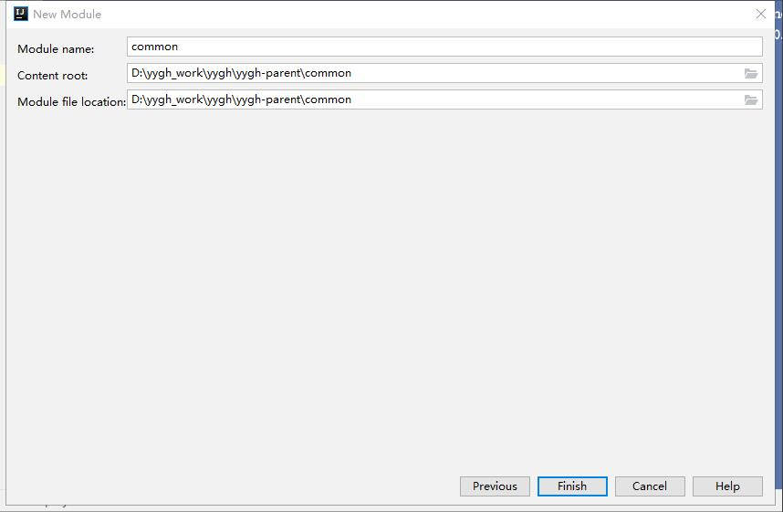
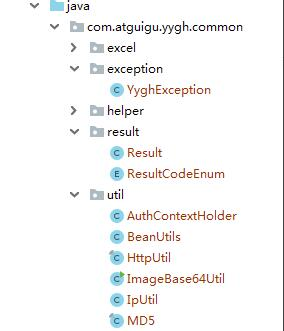
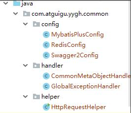
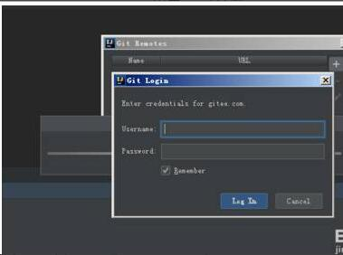

**尚医通**

版本：V1.0

一、预约挂号微服务模块搭建
=====================

项目模块构建
--------------
```
hospital-manage：医院接口模拟端（已开发，直接使用）

yygh-parent：根目录，管理子模块：

common：公共模块父节点

common-util：工具类模块，所有模块都可以依赖于它

rabbit-util：rabbitmq业务封装

service-util：service服务的工具包，包含service服务的公共配置类，所有 service模块依赖于它

server-gateway：服务网关

model：实体类模块

service：api接口服务父节点

service-hosp：医院api接口服务

service-cmn：公共api接口服务

service-user：用户api接口服务

service-order：订单api接口服务

service-oss：文件api接口服务

service-sms：短信 api接口服务

service-task：定时任务服务

service-statistics：统计api接口服务

service-client：feign服务调用父节点

service-cmn-client：公共api接口

service-hosp-client：医院api接口

service-order-client：订单api接口

service-user：用户api接口
```


sql资源
-------------

导入sql：资料/sql/*.sql

1 构建父工程（yygh-parent）
-----------------------------

父工程目录我们已经通过git引入


### 1.1 添加配置pom.xml
```
<!--配置dependencyManagement锁定依赖的版本-->
<dependencyManagement>  
<dependencies>  
<dependency>  
<groupId>org.springframework.cloud</groupId>  
<artifactId>spring-cloud-dependencies</artifactId>  
<version>${cloud.version}</version>  
<type>pom</type>  
<scope>import</scope>  
</dependency>

<dependency>  
<groupId>com.alibaba.cloud</groupId>  
<artifactId>spring-cloud-alibaba-dependencies</artifactId>  
<version>${alibaba.version}</version>  
<type>pom</type>  
<scope>import</scope>  
</dependency>

<!--mybatis-plus 持久层--><dependency>  
<groupId>com.baomidou</groupId>  
<artifactId>mybatis-plus-boot-starter</artifactId>  
<version>${mybatis-plus.version}</version>  
</dependency>

<dependency>  
<groupId>mysql</groupId>  
<artifactId>mysql-connector-java</artifactId>  
<version>${mysql.version}</version>  
</dependency>

<!--swagger--><dependency>  
<groupId>io.springfox</groupId>  
<artifactId>springfox-swagger2</artifactId>  
<version>${swagger.version}</version>  
</dependency>  
<!--swagger ui--><dependency>  
<groupId>io.springfox</groupId>  
<artifactId>springfox-swagger-ui</artifactId>  
<version>${swagger.version}</version>  
</dependency>

<dependency>  
<groupId>io.jsonwebtoken</groupId>  
<artifactId>jjwt</artifactId>  
<version>${jwt.version}</version>  
</dependency>

<dependency>  
<groupId>org.apache.httpcomponents</groupId>  
<artifactId>httpclient</artifactId>  
<version>${httpclient.version}</version>  
</dependency>

<dependency>  
<groupId>com.alibaba</groupId>  
<artifactId>fastjson</artifactId>  
<version>${fastjson.version}</version>  
</dependency>

<dependency>  
<groupId>com.alibaba</groupId>  
<artifactId>easyexcel</artifactId>  
<version>${easyexcel.version}</version>  
</dependency>

<dependency>  
<groupId>com.aliyun</groupId>  
<artifactId>aliyun-java-sdk-core</artifactId>  
<version>${aliyun.version}</version>  
</dependency>

<dependency>  
<groupId>com.aliyun.oss</groupId>  
<artifactId>aliyun-sdk-oss</artifactId>  
<version>${oss.version}</version>  
</dependency>

<!--日期时间工具--><dependency>  
<groupId>joda-time</groupId>  
<artifactId>joda-time</artifactId>  
<version>${jodatime.version}</version>  
</dependency>  
</dependencies>  
</dependencyManagement></project>
```
2 搭建common父模块
----------------------

common：公共模块父节点

common-util：工具类模块，所有模块都可以依赖于它

service-util：service服务的工具包，包含service服务的公共配置类，所有 service模块依赖于它

### 2.1 搭建common

点击yygh-parent，选择New–>Module,操作如下


选择下一步


选择下一步



完成，删除src目录，结构如下


### 2.2 修改配置pom.xml
```
<?xml version="1.0" encoding="UTF-8"?><project xmlns="http://maven.apache.org/POM/4.0.0" xmlns:xsi="http://www.w3.org/2001/XMLSchema-instance"xsi:schemaLocation="http://maven.apache.org/POM/4.0.0 https://maven.apache.org/xsd/maven-4.0.0.xsd">  
<modelVersion>4.0.0</modelVersion>

<parent>  
<groupId>com.atguigu.yygh</groupId>  
<artifactId>yygh-parent</artifactId>  
<version>1.0</version>  
</parent>

<artifactId>common</artifactId>  
<packaging>pom</packaging>  
<version>1.0</version>

<dependencies>  
<dependency>  
<groupId>org.springframework.boot</groupId>  
<artifactId>spring-boot-starter-web</artifactId>  
<scope>provided </scope>  
</dependency>

<!--mybatis-plus--><dependency>  
<groupId>com.baomidou</groupId>  
<artifactId>mybatis-plus-boot-starter</artifactId>  
<scope>provided </scope>  
</dependency>

<!--lombok用来简化实体类：需要安装lombok插件--><dependency>  
<groupId>org.projectlombok</groupId>  
<artifactId>lombok</artifactId>  
</dependency>

<!--swagger--><dependency>  
<groupId>io.springfox</groupId>  
<artifactId>springfox-swagger2</artifactId>  
</dependency>  
<dependency>  
<groupId>io.springfox</groupId>  
<artifactId>springfox-swagger-ui</artifactId>  
</dependency>  
</dependencies>  
</project>
```
3 搭建common-util模块
--------------------------

### 3.1 搭建common-util

点击common，选择New–>Module,操作如下


选择下一步


选择下一步


完成，结构如下


### 3.2 修改配置pom.xml
```
<?xml version="1.0" encoding="UTF-8"?><project xmlns="http://maven.apache.org/POM/4.0.0" xmlns:xsi="http://www.w3.org/2001/XMLSchema-instance"xsi:schemaLocation="http://maven.apache.org/POM/4.0.0 https://maven.apache.org/xsd/maven-4.0.0.xsd">  
<modelVersion>4.0.0</modelVersion>  
<parent>  
<groupId>com.atguigu.yygh</groupId>  
<artifactId>common</artifactId>  
<version>1.0</version>  
</parent>

<artifactId>common-util</artifactId>  
<version>1.0</version>

<packaging>jar</packaging>  
<name>common-util</name>  
<description>common-util</description>

<dependencies>  
<dependency>  
<groupId>org.apache.httpcomponents</groupId>  
<artifactId>httpclient</artifactId>  
</dependency>

<dependency>  
<groupId>com.alibaba</groupId>  
<artifactId>fastjson</artifactId>  
</dependency>

<dependency>  
<groupId>io.jsonwebtoken</groupId>  
<artifactId>jjwt</artifactId>  
</dependency>

<dependency>  
<groupId>com.alibaba</groupId>  
<artifactId>easyexcel</artifactId>  
</dependency>

<!-- 日期工具栏依赖 --><dependency>  
<groupId>joda-time</groupId>  
<artifactId>joda-time</artifactId>  
</dependency>  
</dependencies>

</project>
```
### 3.3 添加公共工具类



YyghException

自定义全局异常

Result

API统一返回结果封装类

ResultCodeEnum

API统一返回结果状态信息

BeanUtils

实体bean copy工具类

MD5

MD5加密工具类

4搭建service-util模块
-------------------------

### 4.1 搭建service-util

搭建过程同common-util

如图


### 4.2 修改配置pom.xml
```
<?xml version="1.0" encoding="UTF-8"?><project xmlns="http://maven.apache.org/POM/4.0.0" xmlns:xsi="http://www.w3.org/2001/XMLSchema-instance"xsi:schemaLocation="http://maven.apache.org/POM/4.0.0 https://maven.apache.org/xsd/maven-4.0.0.xsd">  
<modelVersion>4.0.0</modelVersion>  
<parent>  
<groupId>com.atguigu.yygh</groupId>  
<artifactId>common</artifactId>  
<version>1.0</version>  
</parent>

<artifactId>service-util</artifactId>  
<version>1.0</version>

<packaging>jar</packaging>  
<name>service-util</name>  
<description>service-util</description>  
<dependencies>  
<dependency>  
<groupId>com.atguigu.yygh</groupId>  
<artifactId>common-util</artifactId>  
<version>1.0</version>  
</dependency>  
<!-- redis --><dependency>  
<groupId>org.springframework.boot</groupId>  
<artifactId>spring-boot-starter-data-redis</artifactId>  
</dependency>  
<!-- spring2.X集成redis所需common-pool2--><dependency>  
<groupId>org.apache.commons</groupId>  
<artifactId>commons-pool2</artifactId>  
<version>2.6.0</version>  
</dependency>  
</dependencies>  
</project>
```
### 4.3 添加service-util公共类



MybatisPlusConfig

MybatisPlus配置类

CommonMetaObjectHandler

Mybatis plus Handler配置类
```
package com.atguigu.yygh.common.config;

/*** MybatisPlus配置类*/

@EnableTransactionManagement //事务处理
@Configuration  
@MapperScan("com.atguigu.yygh..mapper")  
public class MybatisPlusConfig {

/*** 分页插件*/

@Bean  
public PaginationInterceptor paginationInterceptor() {  
PaginationInterceptor paginationInterceptor = new PaginationInterceptor();  
// paginationInterceptor.setLimit(你的最大单页限制数量，默认 500 条，小于 0 如 -1 不受限制);return paginationInterceptor;  
}

/*** 乐观锁配置*/@Bean  
public OptimisticLockerInterceptor optimisticLockerInterceptor() {  
return new OptimisticLockerInterceptor();  
}  
}

package com.atguigu.yygh.common.handler;  
/*** Mybatis plus Handler配置类*/@Component  
public class CommonMetaObjectHandler implements MetaObjectHandler {

@Override  
public void insertFill(MetaObject metaObject) {  
this.setFieldValByName("createTime", new Date(), metaObject);  
this.setFieldValByName("updateTime", new Date(), metaObject);  
}  
@Override  
public void updateFill(MetaObject metaObject) {  
this.setFieldValByName("updateTime", new Date(), metaObject);  
}  
}
```
5搭建model模块
------------------

### 5.1 搭建model

搭建过程同common-util父模块

### 5.2 修改配置pom.xml
```
<?xml version="1.0" encoding="UTF-8"?><project xmlns="http://maven.apache.org/POM/4.0.0"xmlns:xsi="http://www.w3.org/2001/XMLSchema-instance"xsi:schemaLocation="http://maven.apache.org/POM/4.0.0 http://maven.apache.org/xsd/maven-4.0.0.xsd">  
<modelVersion>4.0.0</modelVersion>

<parent>  
<groupId>com.atguigu.yygh</groupId>  
<artifactId>yygh-parent</artifactId>  
<version>1.0</version>  
</parent>

<artifactId>model</artifactId>  
<version>1.0</version>  
<packaging>jar</packaging>  
<name>model</name>  
<description>model</description>  
<dependencies>  
<dependency>  
<groupId>org.projectlombok</groupId>  
<artifactId>lombok</artifactId>  
</dependency>  
<!--mybatis-plus--><dependency>  
<groupId>com.baomidou</groupId>  
<artifactId>mybatis-plus-boot-starter</artifactId>  
<scope>provided </scope>  
</dependency>  
<!--swagger--><dependency>  
<groupId>io.springfox</groupId>  
<artifactId>springfox-swagger2</artifactId>  
<scope>provided </scope>  
</dependency>  
<dependency>  
<groupId>com.alibaba</groupId>  
<artifactId>easyexcel</artifactId>  
<scope>provided </scope>  
</dependency>  
<dependency>  
<groupId>org.springframework.boot</groupId>  
<artifactId>spring-boot-starter-data-mongodb</artifactId>  
<scope>provided </scope>  
</dependency>  
<dependency>  
<groupId>com.alibaba</groupId>  
<artifactId>fastjson</artifactId>  
<scope>provided </scope>  
</dependency>  
</dependencies>  
</project>
```
### 5.3 引入实体类

将实体类都引入进来，后续不再单独引入，实体类没有业务逻辑，提前引入，方便后续开发。

6搭建service父模块
---------------------

service：service模块父节点

service-user：会员服务模块

...

### 6.1 搭建service

搭建过程同common父模块

### 6.2 修改配置pom.xml
```
<?xml version="1.0" encoding="UTF-8"?><project xmlns="http://maven.apache.org/POM/4.0.0"xmlns:xsi="http://www.w3.org/2001/XMLSchema-instance"xsi:schemaLocation="http://maven.apache.org/POM/4.0.0 http://maven.apache.org/xsd/maven-4.0.0.xsd">  
<parent>  
<artifactId>yygh-parent</artifactId>  
<groupId>com.atguigu.yygh</groupId>  
<version>1.0</version>  
</parent>  
<modelVersion>4.0.0</modelVersion>

<artifactId>service</artifactId>  
<packaging>pom</packaging>  
<version>1.0</version>  
<dependencies>  
<dependency>  
<groupId>com.atguigu.yygh</groupId>  
<artifactId>service-util</artifactId>  
<version>1.0</version>  
</dependency>  
<dependency>  
<groupId>com.atguigu.yygh</groupId>  
<artifactId>model</artifactId>  
<version>1.0</version>  
</dependency>  
<!--web--><dependency>  
<groupId>org.springframework.boot</groupId>  
<artifactId>spring-boot-starter-web</artifactId>  
</dependency>  
<!--mybatis-plus--><dependency>  
<groupId>com.baomidou</groupId>  
<artifactId>mybatis-plus-boot-starter</artifactId>  
</dependency>  
<!--mysql--><dependency>  
<groupId>mysql</groupId>  
<artifactId>mysql-connector-java</artifactId>  
</dependency>  
<!--开发者工具--><dependency>  
<groupId>org.springframework.boot</groupId>  
<artifactId>spring-boot-devtools</artifactId>  
<optional>true</optional>  
</dependency>  
<!-- 服务调用feign --><dependency>  
<groupId>org.springframework.cloud</groupId>  
<artifactId>spring-cloud-starter-openfeign</artifactId>  
</dependency>  
<!-- 服务注册 --><dependency>  
<groupId>com.alibaba.cloud</groupId>  
<artifactId>spring-cloud-starter-alibaba-nacos-discovery</artifactId>  
</dependency><!-- 流量控制 --><dependency>  
<groupId>com.alibaba.cloud</groupId>  
<artifactId>spring-cloud-starter-alibaba-sentinel</artifactId>  
</dependency>  
</dependencies>  
<build>  
<plugins>  
<plugin>  
<groupId>org.springframework.boot</groupId>  
<artifactId>spring-boot-maven-plugin</artifactId>  
</plugin>  
</plugins>  
<resources>  
<resource>  
<directory>src/main/java</directory>  
<includes>  
<include>**/*.yml</include>  
<include>**/*.properties</include>  
<include>**/*.xml</include>  
</includes>  
<filtering>false</filtering>  
</resource>  
<resource>  
<directory>src/main/resources</directory>  
<includes><include>**/*.yml</include>  
<include>**/*.properties</include>  
<include>**/*.xml</include>  
</includes>  
<filtering>false</filtering>  
</resource>  
</resources>  
</build>  
</project>
```
二、gitee使用
=================

1. 创建仓库
-------------------


2.  点击创建
-------------------


**3**复制gitee码云的HttpS连接
-------------------------------


4 提交上传
--------------

打开项目并点击菜单栏上的【CVS】--》【Import into version control】--》【Create Git Repository】创建本地仓库


在打开的【Create Git Repository】对话框内选择本地仓库的位置，这里我选择项目的根目录。


右击项目点击【Git】--》【Add】，接着点击【Git】--》【Commit Directory】在打开的窗口中选择要上传到本地仓库的代码并添加注释后提交到本地仓库内。


右击项目点击【Git】--》【Repository】--》【Remotes...】。在打开的【Git Remotes】窗口中添加码云的远程仓库。


点击【OK】后接着输入码云的账号密码。



上传代码到码云，右击项目点击【Git】--》【Repository】--》【Push...】在打开的【Push commits】内可以看到已提交到本地仓库的提交信息。点击【Push】按钮将本地仓库的代码上传到码云上，上传成功后就可以在码云上看到。


三、医院设置需求
================

**1、**需求
----------------

医院设置主要是用来保存开通医院的一些基本信息，每个医院一条信息，保存了医院编号（平台分配，全局唯一）和接口调用相关的签名key等信息，是整个流程的第一步，只有开通了医院设置信息，才可以上传医院相关信息。

我们所开发的功能就是基于单表的一个CRUD、锁定/解锁和发送签名信息这些基本功能。

2、表结构
-------------


hosname：医院名称

hoscode：医院编号（平台分配，全局唯一，api接口必填信息）

api_url：医院回调的基础url（如：预约下单，我们要调用该地址去医院下单）

sign_key：双方api接口调用的签名key，有平台生成

contacts_name：医院联系人姓名

contacts_phone：医院联系人手机

status：状态（锁定/解锁）

四、医院模块开发
================

**1、**搭建医院模块service-hosp
---------------------------------

### **1.1**搭建service-hosp

点击service，选择New–>Module,操作如下


选择下一步


选择下一步


完成，结构如下：


### **1.2**修改配置

1、修改pom.xml
```
<?xml version="1.0"encoding="UTF-8"?><project xmlns="http://maven.apache.org/POM/4.0.0"xmlns:xsi="http://www.w3.org/2001/XMLSchema-instance"xsi:schemaLocation="http://maven.apache.org/POM/4.0.0 http://maven.apache.org/xsd/maven-4.0.0.xsd">  
<parent>  
<artifactId>service</artifactId>  
<groupId>com.atguigu.yygh</groupId>  
<version>1.0</version>  
</parent>  
<modelVersion>4.0.0</modelVersion>

<version>1.0</version>  
<artifactId>service-hosp</artifactId>  
<packaging>jar</packaging>  
<name>service-hosp</name>  
<description>service-hosp</description>

<dependencies>  
</dependencies>

<build>  
<finalName>service-hosp</finalName>  
<plugins>  
<plugin>  
<groupId>org.springframework.boot</groupId>  
<artifactId>spring-boot-maven-plugin</artifactId>  
</plugin>  
</plugins>  
</build>

</project>
```
2、添加配置文件application.properties

```
# 服务端口
server.port=8201
# 服务名
spring.application.name=service-hosp

# 环境设置：dev、test、prod
spring.profiles.active=dev

# mysql数据库连接
spring.datasource.driver-class-name=com.mysql.jdbc.Driver
spring.datasource.url=jdbc:mysql://192.168.44.163:3306/yygh_hosp?characterEncoding=utf-8&useSSL=false
spring.datasource.username=root
spring.datasource.password=root123

#返回json的全局时间格式
spring.jackson.date-format=yyyy-MM-dd HH:mm:ss
spring.jackson.time-zone=GMT+8

#配置mapper xml文件的路径
#mybatis-plus.mapper-locations=classpath:com/atguigu/yygh/mapper/xml/*.xml
mybatis-plus.mapper-locations=classpath:com/atguigu/yygh/mapper/xml/*.xml
# nacos服务地址
spring.cloud.nacos.discovery.server-addr=127.0.0.1:8848

#开启sentinel
feign.sentinel.enabled=true
#设置sentinel地址
spring.cloud.sentinel.transport.dashboard=http://127.0.0.1:8858

#mongodb地址
spring.data.mongodb.host=192.168.44.163
spring.data.mongodb.port=27017
spring.data.mongodb.database=yygh_hosp

#rabbitmq地址
spring.rabbitmq.host=127.0.0.1
spring.rabbitmq.port=5672
spring.rabbitmq.username=guest
spring.rabbitmq.password=guest
```

### 1.3 添加启动类

添加com.atguigu.yygh.ServiceHospApplication类

```
package com.atguigu.yygh;  
    @SpringBootApplication  
    public class ServiceHospApplication {  
    public static void main(String[] args) {  
    SpringApplication.run(ServiceHospApplication.class, args);  
    }  
}
```
2添加医院设置CURD
-------------------

### 2.1 添加model

说明：由于实体对象没有逻辑，我们已经统一导入

com.atguigu.yygh.model.hosp.HospitalSet

### 2.2 添加Mapper

添加com.atguigu.yygh.hosp.mapper.HospitalSetMapper
```
package com.atguigu.yygh.hosp.mapper;

@Mapper  
public interface HospitalSetMapper extends BaseMapper<HospitalSet> {

}
```
在mapper/xml下添加HospitalSetMapper.xml
```
<?xml version="1.0" encoding="UTF-8" ?><!DOCTYPEmapperPUBLIC"-//mybatis.org//DTD Mapper 3.0//EN""http://mybatis.org/dtd/mybatis-3-mapper.dtd"><mapper namespace="com.atguigu.yygh.hosp.mapper.HospitalSetMapper">

</mapper>
```
### 2.3 添加service接口及实现类

1、添加com.atguigu.yygh.hosp.service.HospitalSetService接口
```
package com.atguigu.yygh.hosp.service;

public interface HospitalSetService extends IService<HospitalSetService> {  
}
```
2、添加com.atguigu.yygh.hosp.service.impl.HospitalSetServiceImpl接口实现
```
package com.atguigu.yygh.hosp.service.impl;

@Service  
public class HospitalSetServiceImpl extends ServiceImpl<HospitalSetMapper, HospitalSet>implements HospitalSetService {

@Autowired  
private HospitalSetMapper hospitalSetMapper;

}
```
### 2.4 添加controller

添加com.atguigu.yygh.hosp.controller.HospitalSetController类
```
package com.atguigu.yygh.hosp.controller;

@RestController  
@RequestMapping("/admin/hosp/hospitalSet")  
public class HospitalSetController {

@Autowired  
private HospitalSetService hospitalSetService;

}
```
### 2.5 医院设置CRUD

由于com.baomidou.mybatisplus.extension.service.impl.ServiceImpl类已经默认实现 了单表的CRUD，分页查询也有默认实现，能够更加灵活和代码简洁把分页查询功能实现。

### 2.6 添加controller方法
```
@Api(tags = "医院设置管理")  
@RestController  
@RequestMapping("/admin/hosp/hospitalSet")  
public class HospitalSetController {

    //注入service@Autowired  
    private HospitalSetService hospitalSetService;  
    //1 查询医院设置表所有信息@ApiOperation(value = "获取所有医院设置")  
    @GetMapping("findAll")  
    public Result findAllHospitalSet() {  
    //调用service的方法List<HospitalSet> list = hospitalSetService.list();  
    return Result.ok(list);  
}

//2 逻辑删除医院设置@ApiOperation(value = "逻辑删除医院设置")  
@DeleteMapping("{id}")  
public Result removeHospSet(@PathVariable Long id) {  
    boolean flag = hospitalSetService.removeById(id);  
    if(flag) {  
    return Result.ok();  
    } else {  
    return Result.fail();  
    }  
}

//3 条件查询带分页@PostMapping("findPageHospSet/{current}/{limit}")  
public Result findPageHospSet(@PathVariable long current,  
@PathVariable long limit,  
@RequestBody(required = false) HospitalSetQueryVo hospitalSetQueryVo) {  
    //创建page对象，传递当前页，每页记录数Page<HospitalSet> page = new Page<>(current,limit);  
    //构建条件QueryWrapper<HospitalSet> wrapper = new QueryWrapper<>();  
    String hosname = hospitalSetQueryVo.getHosname();//医院名称
    String hoscode = hospitalSetQueryVo.getHoscode();//医院编号
    if(!StringUtils.isEmpty(hosname)) {  
    wrapper.like("hosname",hospitalSetQueryVo.getHosname());  
    }  
    if(!StringUtils.isEmpty(hoscode)) {  
    wrapper.eq("hoscode",hospitalSetQueryVo.getHoscode());  
    }  
    //调用方法实现分页查询
    Page<HospitalSet> pageHospitalSet = hospitalSetService.page(page, wrapper);  
    //返回结果
    return Result.ok(pageHospitalSet);  
}

//4 添加医院设置@PostMapping("saveHospitalSet")  
public Result saveHospitalSet(@RequestBody HospitalSet hospitalSet) {  
    //设置状态 1 使用 0 不能使用
    hospitalSet.setStatus(1);  
    //签名秘钥
    Random random = new Random();  
    hospitalSet.setSignKey(MD5.encrypt(System.currentTimeMillis()+""+random.nextInt(1000)));  
    //调用
    serviceboolean save = hospitalSetService.save(hospitalSet);  
    if(save) {  
        return Result.ok();  
    } else {  
        return Result.fail();  
    }  
}

//5 根据id获取医院设置@GetMapping("getHospSet/{id}")  
public Result getHospSet(@PathVariable Long id) {  
    HospitalSet hospitalSet = hospitalSetService.getById(id);  
    return Result.ok(hospitalSet);  
}

//6 修改医院设置@PostMapping("updateHospitalSet")  
public Result updateHospitalSet(@RequestBody HospitalSet hospitalSet) {  
    boolean flag = hospitalSetService.updateById(hospitalSet);  
    if(flag) {  
        return Result.ok();  
    } else {  
        return Result.fail();  
    }  
}

//7 批量删除医院设置@DeleteMapping("batchRemove")  
public Result batchRemoveHospitalSet(@RequestBody List<Long> idList) {  
    hospitalSetService.removeByIds(idList);  
        return Result.ok();  
    }  
}
```
说明：一个完整的CRUD就实现了

3、Swagger2介绍与集成
-----------------------

### 3.1 swagger2介绍

什么是swagger2

编写和维护接口文档是每个程序员的职责，根据Swagger2可以快速帮助我们编写最新的API接口文档，再也不用担心开会前仍忙于整理各种资料了，间接提升了团队开发的沟通效率。

常用注解

swagger通过注解表明该接口会生成文档，包括接口名、请求方法、参数、返回信息的等等。

@Api：修饰整个类，描述Controller的作用

@ApiOperation：描述一个类的一个方法，或者说一个接口

@ApiParam：单个参数描述

@ApiModel：用对象来接收参数

@ApiModelProperty：用对象接收参数时，描述对象的一个字段

@ApiImplicitParam：一个请求参数

@ApiImplicitParams：多个请求参数

### 3.2 swagger2集成

#### 3.2.1 项目整合swagger2

在common模块pom.xml引入依赖
```
<!--swagger--><dependency>  
<groupId>io.springfox</groupId>  
<artifactId>springfox-swagger2</artifactId>  
</dependency>  
<dependency>  
<groupId>io.springfox</groupId>  
<artifactId>springfox-swagger-ui</artifactId>  
</dependency>
```
说明：我们在yygh-parent中的pom.xml中添加了版本控制，这里不需要添加版本，已引入就忽略

#### 3.2.2 添加swagger2配置类

在service-util模块添加配置类：

com.atguigu.yygh.common.config.Swagger2Config类

/*** Swagger2配置信息*/
```
@Configuration  
@EnableSwagger2  
public class Swagger2Config {  
@Bean  
public Docket webApiConfig(){  
return new Docket(DocumentationType.SWAGGER_2)  
.groupName("webApi")  
.apiInfo(webApiInfo())  
.select()  
//只显示api路径下的页面.paths(Predicates.and(PathSelectors.regex("/api/.*")))  
.build();  
}

@Bean  
public Docket adminApiConfig(){  
return new Docket(DocumentationType.SWAGGER_2)  
.groupName("adminApi")  
.apiInfo(adminApiInfo())  
.select()  
//只显示admin路径下的页面.paths(Predicates.and(PathSelectors.regex("/admin/.*")))  
.build();  
}

private ApiInfo webApiInfo(){  
return new ApiInfoBuilder()  
.title("网站-API文档")  
.description("本文档描述了网站微服务接口定义")  
.version("1.0")  
.contact(new Contact("atguigu", "http://atguigu.com", "493211102@qq.com"))  
.build();  
}

private ApiInfo adminApiInfo(){  
return new ApiInfoBuilder()  
.title("后台管理系统-API文档")  
.description("本文档描述了后台管理系统微服务接口定义")  
.version("1.0")  
.contact(new Contact("atguigu", "http://atguigu.com", "49321112@qq.com"))  
.build();  
}  
}
```
### 3.3 使用swagger2测试


4、医院锁定与解锁
-----------------

医院锁定后不能再上传数据

### 4.1 添加controller方法

在HospitalSetController类添加方法

@PathVariable 这个注解是做参数的绑定

//8 医院设置锁定和解锁
```
@PutMapping("lockHospitalSet/{id}/{status}")  
public Result lockHospitalSet(@PathVariable Long id,  
@PathVariable Integer status) {  
    //根据id查询医院设置信息
    HospitalSet hospitalSet = hospitalSetService.getById(id);  
    //设置状态
    hospitalSet.setStatus(status);  
    //调用方法
    hospitalSetService.updateById(hospitalSet);  
    return Result.ok();  
}
```
5、发送签名key
-----------------

医院信息配置后，可以通过短信的形式发送医院编号与签名key给联系人，联系人拿到该信息就可以参考《尚医通API接口文档.docx》对接接口了。

### 5.1 添加controller方法

在HospitalSetController类添加方法

//9 发送签名秘钥
```
@PutMapping("sendKey/{id}")  
public Result lockHospitalSet(@PathVariable Long id) {  
    HospitalSet hospitalSet = hospitalSetService.getById(id);  
    String signKey = hospitalSet.getSignKey();  
    String hoscode = hospitalSet.getHoscode();  
    //TODO 发送短信**
    return Result.ok();  
}
```
6、全局异常处理
----------------

spring boot 默认情况下会映射到 /error 进行异常处理，但是提示并不十分友好，下面自定义异常处理，提供友好展示。

### 6.1 自定义异常类

我们在搭建模块时在common-util模块已经添加了YyghException类，这里不做解释

### 6.2 添加全局异常处理类

在service-util模块添加全局异常处理类

@ResponseBody这个注解表示json格式显示
```
package com.atguigu.yygh.common.handler;

/*** 全局异常处理类**/
@ControllerAdvice  
public class GlobalExceptionHandler {

@ExceptionHandler(Exception.class)  
@ResponseBody  
public Result error(Exception e){  
e.printStackTrace();  
return Result.fail();  
}

/*** 自定义异常处理方法* **@param** **e*** **@return***/
@ExceptionHandler(YyghException.class)  
@ResponseBody  
public Result error(YyghException e){  
return Result.build(e.getCode(), e.getMessage());  
}  
}
```
### 6.3 集成测试

手动在controller任意方法制造异常（int i = 1/0），添加GlobalExceptionHandler类与不添加这个类区别

7、日志
------------

### 7.1配置日志级别

日志记录器（Logger）的行为是分等级的。如下表所示：

分为：OFF、FATAL、ERROR、WARN、INFO、DEBUG、ALL

默认情况下，spring boot从控制台打印出来的日志级别只有INFO及以上级别，可以配置日志级别

# 设置日志级别

logging.level.root=WARN

这种方式只能将日志打印在控制台上

### 7.2 Logback日志

spring boot内部使用Logback作为日志实现的框架。

Logback和log4j非常相似，如果你对log4j很熟悉，那对logback很快就会得心应手。

### 7.3 配置日志

resources/logback-spring.xml
```
<?xml version="1.0" encoding="UTF-8"?><configuration scan="true" scanPeriod="10 seconds">  
<!-- 日志级别从低到高分为TRACE < DEBUG < INFO < WARN < ERROR < FATAL，如果设置为WARN，则低于WARN的信息都不会输出 --><!-- scan:当此属性设置为true时，配置文件如果发生改变，将会被重新加载，默认值为true --><!-- scanPeriod:设置监测配置文件是否有修改的时间间隔，如果没有给出时间单位，默认单位是毫秒。当scan为true时，此属性生效。默认的时间间隔为1分钟。 --><!-- debug:当此属性设置为true时，将打印出logback内部日志信息，实时查看logback运行状态。默认值为false。 --><contextName>logback</contextName>  
<!-- name的值是变量的名称，value的值时变量定义的值。通过定义的值会被插入到logger上下文中。定义变量后，可以使“${}”来使用变量。 --><property name="log.path" value="D:/yygh_log/edu" />  
<!-- 彩色日志 --><!-- 配置格式变量：CONSOLE_LOG_PATTERN 彩色日志格式 --><!-- magenta:洋红 --><!-- boldMagenta:粗红--><!-- cyan:青色 --><!-- white:白色 --><!-- magenta:洋红 --><property name="CONSOLE_LOG_PATTERN"value="%yellow(%date{yyyy-MM-dd HH:mm:ss}) |%highlight(%-5level) |%blue(%thread) |%blue(%file:%line) |%green(%logger) |%cyan(%msg%n)"/>  
<!--输出到控制台--><appender name="CONSOLE" class="ch.qos.logback.core.ConsoleAppender">  
<!--此日志appender是为开发使用，只配置最底级别，控制台输出的日志级别是大于或等于此级别的日志信息--><!-- 例如：如果此处配置了INFO级别，则后面其他位置即使配置了DEBUG级别的日志，也不会被输出 --><filter class="ch.qos.logback.classic.filter.ThresholdFilter">  
<level>INFO</level>  
</filter>  
<encoder>  
<Pattern>${CONSOLE_LOG_PATTERN}</Pattern>  
<!-- 设置字符集 --><charset>UTF-8</charset>  
</encoder>  
</appender>  
<!--输出到文件--><!-- 时间滚动输出 level为 INFO 日志 --><appender name="INFO_FILE" class="ch.qos.logback.core.rolling.RollingFileAppender">  
<!-- 正在记录的日志文件的路径及文件名 --><file>${log.path}/log_info.log</file>  
<!--日志文件输出格式--><encoder>  
<pattern>%d{yyyy-MM-dd HH:mm:ss.SSS} [%thread] %-5level %logger{50} - %msg%n</pattern>  
<charset>UTF-8</charset>  
</encoder>  
<!-- 日志记录器的滚动策略，按日期，按大小记录 --><rollingPolicy class="ch.qos.logback.core.rolling.TimeBasedRollingPolicy">  
<!-- 每天日志归档路径以及格式 --><fileNamePattern>${log.path}/info/log-info-%d{yyyy-MM-dd}.%i.log</fileNamePattern>  
<timeBasedFileNamingAndTriggeringPolicy class="ch.qos.logback.core.rolling.SizeAndTimeBasedFNATP">  
<maxFileSize>100MB</maxFileSize>  
</timeBasedFileNamingAndTriggeringPolicy>  
<!--日志文件保留天数--><maxHistory>15</maxHistory>  
</rollingPolicy>  
<!-- 此日志文件只记录info级别的 --><filter class="ch.qos.logback.classic.filter.LevelFilter">  
<level>INFO</level>  
<onMatch>ACCEPT</onMatch>  
<onMismatch>DENY</onMismatch>  
</filter>  
</appender>

<!-- 时间滚动输出 level为 WARN 日志 --><appender name="WARN_FILE" class="ch.qos.logback.core.rolling.RollingFileAppender">  
<!-- 正在记录的日志文件的路径及文件名 --><file>${log.path}/log_warn.log</file>  
<!--日志文件输出格式--><encoder>  
<pattern>%d{yyyy-MM-dd HH:mm:ss.SSS} [%thread] %-5level %logger{50} - %msg%n</pattern>  
<charset>UTF-8</charset><!-- 此处设置字符集 --></encoder>  
<!-- 日志记录器的滚动策略，按日期，按大小记录 --><rollingPolicy class="ch.qos.logback.core.rolling.TimeBasedRollingPolicy">  
<fileNamePattern>${log.path}/warn/log-warn-%d{yyyy-MM-dd}.%i.log</fileNamePattern>  
<timeBasedFileNamingAndTriggeringPolicy class="ch.qos.logback.core.rolling.SizeAndTimeBasedFNATP">  
<maxFileSize>100MB</maxFileSize>  
</timeBasedFileNamingAndTriggeringPolicy>  
<!--日志文件保留天数--><maxHistory>15</maxHistory>  
</rollingPolicy>  
<!-- 此日志文件只记录warn级别的 --><filter class="ch.qos.logback.classic.filter.LevelFilter">  
<level>warn</level>  
<onMatch>ACCEPT</onMatch>  
<onMismatch>DENY</onMismatch>  
</filter>  
</appender>


<!-- 时间滚动输出 level为 ERROR 日志 --><appender name="ERROR_FILE" class="ch.qos.logback.core.rolling.RollingFileAppender">  
<!-- 正在记录的日志文件的路径及文件名 --><file>${log.path}/log_error.log</file>  
<!--日志文件输出格式--><encoder>  
<pattern>%d{yyyy-MM-dd HH:mm:ss.SSS} [%thread] %-5level %logger{50} - %msg%n</pattern>  
<charset>UTF-8</charset><!-- 此处设置字符集 --></encoder>  
<!-- 日志记录器的滚动策略，按日期，按大小记录 --><rollingPolicy class="ch.qos.logback.core.rolling.TimeBasedRollingPolicy">  
<fileNamePattern>${log.path}/error/log-error-%d{yyyy-MM-dd}.%i.log</fileNamePattern>  
<timeBasedFileNamingAndTriggeringPolicy class="ch.qos.logback.core.rolling.SizeAndTimeBasedFNATP">  
<maxFileSize>100MB</maxFileSize>  
</timeBasedFileNamingAndTriggeringPolicy>  
<!--日志文件保留天数--><maxHistory>15</maxHistory>  
</rollingPolicy>  
<!-- 此日志文件只记录ERROR级别的 --><filter class="ch.qos.logback.classic.filter.LevelFilter">  
<level>ERROR</level>  
<onMatch>ACCEPT</onMatch>  
<onMismatch>DENY</onMismatch>  
</filter>  
</appender>

<!--<logger>用来设置某一个包或者具体的某一个类的日志打印级别、以及指定<appender>。<logger>仅有一个name属性，一个可选的level和一个可选的addtivity属性。name:用来指定受此logger约束的某一个包或者具体的某一个类。level:用来设置打印级别，大小写无关：TRACE, DEBUG, INFO, WARN, ERROR, ALL 和 OFF，如果未设置此属性，那么当前logger将会继承上级的级别。--><!--使用mybatis的时候，sql语句是debug下才会打印，而这里我们只配置了info，所以想要查看sql语句的话，有以下两种操作：第一种把<root level="INFO">改成<root level="DEBUG">这样就会打印sql，不过这样日志那边会出现很多其他消息第二种就是单独给mapper下目录配置DEBUG模式，代码如下，这样配置sql语句会打印，其他还是正常DEBUG级别：--><!--开发环境:打印控制台--><springProfile name="dev">  
<!--可以输出项目中的debug日志，包括mybatis的sql日志--><logger name="com.guli" level="INFO" />

<!--root节点是必选节点，用来指定最基础的日志输出级别，只有一个level属性level:用来设置打印级别，大小写无关：TRACE, DEBUG, INFO, WARN, ERROR, ALL 和 OFF，默认是DEBUG可以包含零个或多个appender元素。--><root level="INFO">  
<appender-ref ref="CONSOLE" />  
<appender-ref ref="INFO_FILE" />  
<appender-ref ref="WARN_FILE" />  
<appender-ref ref="ERROR_FILE" />  
</root>  
</springProfile>


<!--生产环境:输出到文件--><springProfile name="pro">

<root level="INFO">  
<appender-ref ref="CONSOLE" />  
<appender-ref ref="DEBUG_FILE" />  
<appender-ref ref="INFO_FILE" />  
<appender-ref ref="ERROR_FILE" />  
<appender-ref ref="WARN_FILE" />  
</root>  
</springProfile>  
</configuration>
```
