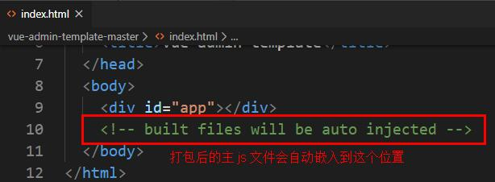
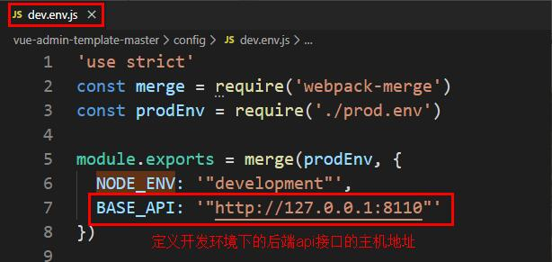

**尚医通**

版本：V1.0

一、NPM包管理器
=====================

1、简介
--------------------
```
什么是NPM
NPM全称Node Package Manager，是Node.js包管理工具，是全球最大的模块生态系统，里面所有的模块都是开源免费的；也是Node.js的包管理工具，相当于前端的Maven 。
#在命令提示符输入 npm -v 可查看当前npm版本
npm-v
```
2、使用npm管理项目
---------------------------

创建npm_pro文件夹

### 2.1项目初始化
```
#建立一个空文件夹，在命令提示符进入该文件夹  执行命令初始化
npm init
#按照提示输入相关信息，如果是用默认值则直接回车即可。
#name: 项目名称
#version: 项目版本号
#description: 项目描述
#keywords: {Array}关键词，便于用户搜索到我们的项目
#最后会生成package.json文件，这个是包的配置文件，相当于maven的pom.xml
#我们之后也可以根据需要进行修改。
#如果想直接生成 package.json 文件，那么可以使用命令
npm init -y
```
### 2.2修改npm镜像
```
NPM官方的管理的包都是从 [http://npmjs.com](http://npmjs.com)下载的，但是这个网站在国内速度很慢。这里推荐使用淘宝 NPM 镜像 [http://npm.taobao.org/](http://npm.taobao.org/) ，淘宝 NPM 镜像是一个完整 npmjs.com 镜像，同步频率目前为 10分钟一次，以保证尽量与官方服务同步。
设置镜像地址：
#经过下面的配置，以后所有的 npm install 都会经过淘宝的镜像地址下载
npm config set registry https://registry.npm.taobao.org
#查看npm配置信息
npm config list
```
### 2.3 npm install命令的使用
```
基本命令
#使用 npm install 安装依赖包的最新版，
#模块安装的位置：项目目录node_modules
#同时package.json 文件中，依赖包会被添加到dependencies节点下，类似maven中的 <dependencies>
#默认参数：--save  简写  -S  将当前依赖保存在dependencies节点下
npm install jquery
下载特定版本的依赖
#如果安装时想指定特定的版本
npm install jquery@2.1.x
下载开发依赖
#devDependencies节点：开发时的依赖包，项目打包到生产环境的时候不包含的依赖
#使用 -D参数将依赖添加到devDependencies节点
npm install --save-dev eslint
#或简写
npm i -D eslint
下载全局依赖
#全局安装
#Node.js全局安装的npm包和工具的位置：用户目录AppDataRoamingnpmnode_modules
#一些命令行工具常使用全局安装的方式
npm install --global webpack
#或简写
npm install -g webpack
根据依赖下载安装包
#npm管理的项目在备份和传输的时候一般不携带node_modules文件夹
#安装会自动在项目目录下添加 package-lock.json文件，这个文件帮助锁定安装包的版本
npm install #根据package.json中的配置下载依赖，初始化项目
```
### 2.4其它命令

```
#更新包（更新到最新版本）
npm update 包名
#全局更新
npm update -g 包名
#卸载包
npm uninstall 包名
#全局卸载
npm uninstall -g 包名
```
二、模块化
=============

1、模块化简介
-----------------------

### 1.1模块化产生的背景

随着网站逐渐变成"互联网应用程序"，嵌入网页的Javascript代码越来越庞大，越来越复杂。


Javascript模块化编程，已经成为一个迫切的需求。理想情况下，开发者只需要实现核心的业务逻辑，其他都可以加载别人已经写好的模块。

### 1.2模块化规范

CommonJS模块化规范（基于ES6语法之前）

ES6模块化规范（使用ES6语法）

2、ES6模块化规范
--------------------------

创建 modularization_pro文件夹

### 2.1 导出模块

创建 src/teacherApi.js 文件
```
export default {
    getList() {        
        console.log('获取讲师列表')
    },
    save() {        
        console.log('保存讲师')
    }
}
```
### 2.2导入模块

创建 src/teacherComponent.js文件
```
import teacherfrom"./teacherApi.js"
teacher.getList()
teacher.save()
ES6使用 export 和 import 来导出、导入模块。
```
### 2.3运行程序
```
node teacherComponent.js
```
注意：这时的程序无法运行的，因为ES6的模块化无法在Node.js中执行，需要用Babel编辑成ES5后再执行。


3、使用Babel转码
---------------------------

ES6的某些高级语法在浏览器环境甚至是Node.js环境中无法执行。

Babel是一个广泛使用的转码器，可以将ES6代码转为ES5代码，从而在现有环境执行执行。

这意味着，你可以现在就用 ES6 编写程序，而不用担心现有环境是否支持。

### 3.1安装

Babel提供babel-cli工具，用于命令行转码。它的安装命令如下：
```
npm install -g babel-cli
#查看是否安装成功
babel --version
```
### 3.2初始化项目

在modularization目录下初始化项目
```
npm init -y
```
### 3.3配置.babelrc

Babel的配置文件是.babelrc，存放在项目的根目录下，该文件用来设置转码规则和插件，presets字段设定转码规则
```
{
    "presets": ["es2015"],
    "plugins": []
}
```
### 3.4安装转码器

在modularization目录中安装

```
npm install -D babel-preset-es2015
```
### 3.5 转码
```
# 整个目录转码
# --out-dir 或 -d 参数指定输出目录
babel src -d dist
```
### 3.6运行程序
```
node dist/teacherComponent.js
```
4、更多的方式
-----------------------

ES6模块化规范还有一些其他的语法格式，常见的另一种写法如下：

src/teacherApi.js：
```
export function getList() {
    console.log('获取讲师列表2')
}
export function save() {
    console.log('保存讲师2')
}
```

src/teacherComponent.js：

```
import {getList, save} from"./teacherApi.js"
getList()
save()
```

三、Webpack
=================

1、什么是Webpack
--------------------

Webpack 是一个前端资源加载/打包工具。它将根据模块的依赖关系进行静态分析，然后将这些模块按照指定的规则生成对应的静态资源。

从图中我们可以看出，Webpack 可以将多种静态资源 js、css、less 转换成一个静态文件，减少了页面的请求。


2、Webpack安装
---------------------------

### 2.1全局安装
```
npm install -g webpack webpack-cli
或
npm install -g webpack
npm install -g webpack-cli
```
### 2.2安装后查看版本号
```
webpack -v
```
3、创建项目
------------------------------

创建 webpack_pro文件夹

### 3.1初始化项目

进入目录，执行命令
```
npm init -y
```
### 3.2创建src文件夹

### 3.3 src下创建common.js

这里使用的是CommonJS模块化方式，这种方式不支持ES6的语法，所以不需要Babel转码
```
exports.info=function (str) {
    document.write(str)
}
```
### 3.4 src下创建utils.js

```
exports.add=function (a, b) {
    return a+b
}
```
### 3.5 src下创建main.js
```
const common=require('./common')
const utils=require('./utils')
common.info('Hello world!'+utils.add(100, 200))
```
4、JS打包
----------------------

### 4.1创建配置文件

webpack_pro目录下创建配置文件webpack.config.js

以下配置的意思是：

读取当前项目目录下src文件夹中的main.js（入口文件）内容，分析资源依赖，把相关的js文件打包

打包后的文件放入当前目录的dist文件夹下

打包后的js文件名为bundle.js
```
constpath=require("path") //Node.js内置模块
module.exports= {
    entry: './src/main.js', //配置入口文件
    output: {
        path: path.resolve(__dirname, './dist'), //输出路径，__dirname：当前文件所在路径
        filename: 'bundle.js'//输出文件
    }
}
```
### 4.2执行编译命令
```
webpack --mode=development
```
#执行后查看bundle.js 里面包含了上面两个js文件的内容并进行了代码打包

也可以配置项目的npm运行命令，修改package.json文件
```
"scripts": {
    //...,
    "dev": "webpack --mode=development",
    "prod": "webpack --mode=production"
}
```
运行npm命令执行打包
```
npm run dev #开发打包
或
npm run prod #生产打包
```
### 4.3创建入口页面

webpack_pro目录下创建index.html，引用bundle.js
```
<scriptsrc="dist/bundle.js"></script>
```
### 4.4测试

浏览器中查看index.html

5、CSS打包
-----------------------

### 5.1安装插件

Webpack 本身只能处理 JavaScript 模块，如果要处理其他类型的文件，就需要使用 loader 进行转换。

Loader 可以理解为是模块和资源的转换器。

首先我们需要安装相关Loader插件，css-loader 是将 css 装载到 javascript；style-loader 是让 javascript 认识css
```
npm install -D style-loader css-loader
```
### 5.2修改webpack.config.js
```
const path=require("path"); //Node.js内置模块
module.exports= {
    //...,
    output:{
    //其他配置
    },
    module: {
        rules: [
            {
            test: /.css$/,    //打包规则应用到以css结尾的文件上
            use: ['style-loader', 'css-loader']
            }
        ]
    }
}
```
### 5.3在src文件夹创建style.css
```
body{
    background:pink;
}
```
### 5.4修改main.js 

在第一行引入style.css
```
require('./style.css')
```
### 5.5运行编译命令
```
npm run dev
```
### 5.6测试

浏览器中查看index.html，看看背景是不是变成粉色啦？

四、vue-element-admin
===============================

1、vue-element-admin
-----------------------------------

### 1.1简介

vue-element-admin是基于element-ui 的一套后台管理系统集成方案。

GitHub地址：[https://github.com/PanJiaChen/vue-element-admin](https://github.com/PanJiaChen/vue-element-admin)

项目在线预览：[https://panjiachen.gitee.io/vue-element-admin](#/login?redirect=/dashboard)

1.2安装
-------------
```
# 解压压缩包
# 进入目录
cd vue-element-admin-master
# 安装依赖
npm install
# 启动。执行后，浏览器自动弹出并访问http://localhost:9527/
npm run dev
```

如果上面的install报错


则先执行下面的命令，再install
```
npm i -g node-sass --sass_binary_site=https://npm.taobao.org/mirrors/node-sass/
```
2、vue-admin-template
--------------------------------------------

### 2.1简介

vueAdmin-template是基于vue-element-admin的一套后台管理系统基础模板（最少精简版），可作为模板进行二次开发。

GitHub地址：[https://github.com/PanJiaChen/vue-admin-template](https://github.com/PanJiaChen/vue-admin-template)

建议：你可以在 vue-admin-template 的基础上进行二次开发，把 vue-element-admin当做工具箱，想要什么功能或者组件就去 vue-element-admin 那里复制过来。

### 2.2安装
```
# 解压压缩包
# 进入目录
cd vue-admin-template-master
# 安装依赖
npm install
# 启动。执行后，浏览器自动弹出并访问http://localhost:9528/
npm run dev
```
五、前端框架了解
====================

1、目录结构
----------------------

vue-element-admin-master（拥有完整的功能的插件）


2、关键文件
----------------------

vue-admin-template-master（源码相对简单，我们的后台管理系统基于这个版本）

### 2.1 package.js
```
npm项目的核心配置文件，包含项目信息，项目依赖，项目启动相关脚本
启动项目的命令： npm run dev
dev脚本：webpack-dev-server --inline --progress --config build/webpack.dev.conf.js
webpack-dev-server：一个小型的基于Node.js的http服务器，可以运行前端项目
--inline：一种启动模式
--progress：显示启动进度
--config build/webpack.dev.conf.js：指定webpack配置文件所在位置
```


### 2.2 build/webpack.dev.conf.js

webpack配置文件，包含项目在开发环境打包和运行的相关配置

webpack.dev.conf.js 中引用了 webpack.base.conf.js

webpack.base.conf.js 中定义了项目打包的入口文件


在HtmlWebpackPlugin配置html模板，生成的js就会自动插入到模板中，如下面的配置。

因此生成的js文件会被自动插入到名为index.html的页面中


### 2.3 index.html

项目默认的html页面




### 2.4 src/main.js

项目js入口文件，项目的所有前端功能都在这个文件中引入和定义，并初始化全局的Vue对象


### 2.5config/dev.env.js

定义全局常量值




因此，在项目中的任意位置可以直接使用 process.env.BASE_API 常量表示后端接口的主机地址

### 2.6 src/utils/request.js

引入axios模块，定义全局的axios实例，并导出模块


### 2.7 src/api/login.js

引用request模块，调用远程api


六、临时登录接口
====================

1、前端登录问题
------------------------

默认情况下，前端项目已经实现了登录功能，后端连接到远程Mock平台的模拟数据接口进行登录，而Mock平台地址无效，导致前端的登录功能无法执行

