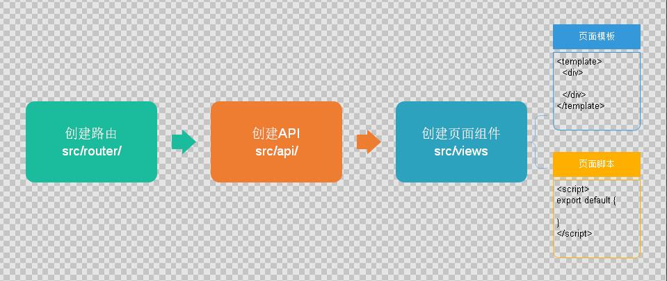
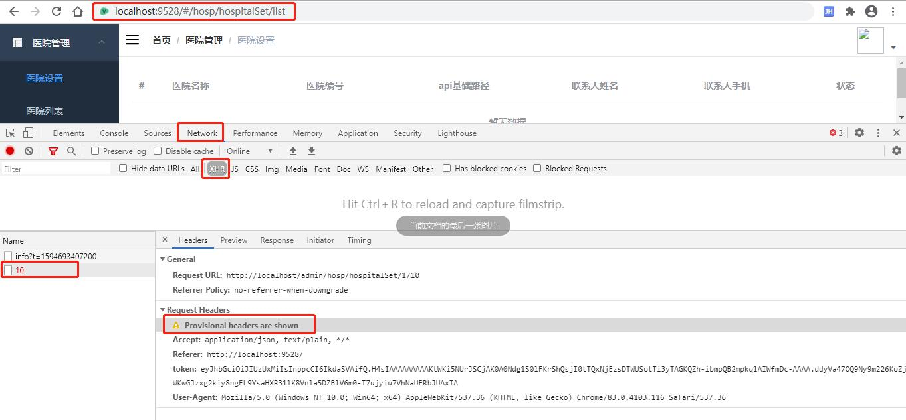

尚医通

版本：V1.0

一、管理平台前端搭建
======================

1、项目名称
--------------

解压vue-admin-template-master.zip，项目重命名：yygh-admin

2、修改package.json
------------------------------------

{  
"name": "yygh-admin",  
"version": "3.8.0",  
"license": "MIT",  
"description": "尚医通管理平台系统",  
"author": "493111402@qq.com",  
}

3、如果需要修改端口号
-------------------

config/index.js中修改

port: 9528

4、项目的目录结构
-----------------

├── build // 构建脚本

├── config // 全局配置

├── node_modules // 项目依赖模块

├── src //项目源代码

├── static // 静态资源

└── package.jspon // 项目信息和依赖配置

src

├── api // 各种接口

├── assets // 图片等资源

├── components // 各种公共组件，非公共组件在各自view下维护

├── icons //svg icon

├── router // 路由表

├── store // 存储

├── styles // 各种样式

├── utils // 公共工具，非公共工具，在各自view下维护

├── views // 各种layout

├── App.vue //***项目顶层组件***

├── main.js //***项目入口文件***

└── permission.js //认证入口

5、运行项目
------------------
```
npm insall
npm run dev
```

6、登录页修改
---------------

将登陆相关请求接口改为静态数据，不请求接口

修改文件：src/store/modules/user.js

注释掉：Login、GetInfo、LogOut三个方法，替换为如下代码：

```
Login({ commit }) {  
    const data = {  
    'token': 'admin'}  
    setToken(data.token)// 将token存储在cookie中commit('SET_TOKEN', data.token)  
},

GetInfo({ commit }) {  
    const data = {  
        'roles': ['admin'],  
        'name': 'admin',  
        'avatar': 'https://wpimg.wallstcn.com/f778738c-e4f8-4870-b634-56703b4acafe.gif'}  
    if (data.roles &&data.roles.length >0) { // 验证返回的roles是否是一个非空数组commit('SET_ROLES', data.roles)  
}  
    commit('SET_NAME', data.name)  
    commit('SET_AVATAR', data.avatar)  
},

// 登出LogOut({ commit, state }) {  
    return new Promise((resolve, reject) => {  
        commit('SET_TOKEN', '')  
        commit('SET_ROLES', [])  
        removeToken()  
        resolve()  
    })  
}
```
说明：token是我们手动配置的，如果过期后续自行生成，后续会有TokenHelper类生成token，在此不用关注

修改src/util/request.js
```
config.headers['token'] = getToken()
```
6、页面零星修改
--------------------

### 6.1标题

index.html（项目的html入口）
```
<title>尚医通管理平台系统</title>
```
### 6.2 国际化设置

打开 src/main.js（项目的js入口），第7行，修改语言为 zh-CN，使用中文语言环境，例如：日期时间组件
```
import locale from 'element-ui/lib/locale/lang/zh-CN' // lang i18n
```
### 6.3 导航栏文字

src/views/layout/components（当前项目的布局组件）

src/views/layout/components/Navbar.vue
```
13行

<el-dropdown-item>

首页

</el-dropdown-item>

17行

<span style="display:block;" @click="logout">退出</span>
```
### 6.4 面包屑文字

src/components（可以在很多项目中复用的通用组件）

src/components/Breadcrumb/index.vue
```
38行

meta: { title: '首页' }
```
### 6.5 关闭校验

打开config/index.js，配置是否开启语法检查
```
useEslint: false,
```
### 6.6 复制icon图标

将vue-element-admin/src/icons/svg 中的图标复制到 guli-admin项目中


7、路由分析
------------------

### 7.1 入口文件中调用路由
```
src/main.js

import router from './router'//引入路由模块
    new Vue({  
        el: '#app',  
        router,  
        store,  
        render: h => h(App)  
    })
```
### 7.2 路由模块中定义路由

src/router/index.js

```
export const constantRouterMap = [  
    { path: '*', redirect: '/404', hidden: true }  
    ]

export default new Router({  
    // mode: 'history', //后端支持可开scrollBehavior: () => ({ y: 0 }),  
    routes: constantRouterMap  
})
```
说明：我们后续菜单路由就在此配置

二、医院设置管理
====================

1、项目开发流程
--------------------



### 1.1 定义路由模块

src/router/index.js

配置医院设置管理相关路由
```
{  
path: '/hosp',  
component: Layout,  
redirect: '/hosp/hospital/list',  
name: 'hospital',  
meta: { title: '医院管理', icon: 'table' },  
    children: [  
        {  
        path: 'hospitalSet/list',  
        name: '医院设置',  
        component: () =>import('@/views/hosp/hospitalSet/list'),  
        meta: { title: '医院设置' }  
        },  
        {  
        path: 'hospitalSet/add',  
        name: 'EduTeacherCreate',  
        component: () =>import('@/views/hosp/hospitalSet/form'),  
        meta: { title: '添加' },  
        hidden: true},  
        {  
        path: 'hospitalSet/edit/:id',  
        name: 'EduTeacherEdit',  
        component: () =>import('@/views/hosp/hospitalSet/form'),  
        meta: { title: '编辑', noCache: true },  
        hidden: true}  
    ]  
}
```
### 1.2 定义api模块

创建文件 src/api/hosp/hospitalSet.js
```
import request from '@/utils/request'
const api_name = '/admin/hosp/hospitalSet'
export default {
    getPageList(page, limit, searchObj) {  
        return request({  
            url: `${api_name}/${page}/${limit}`,  
            method: 'get',  
            params: searchObj  
        })  
    }  
}
```
### 1.3 定义页面组件脚本

src/views/hosp/hospitalSet/list.vue

```
<script>  
    import hospitalSetApi from '@/api/hosp/hospitalSet'
    
    export default {  
                // 定义数据模型
             data() {  
                return {  
                    list: null // 列表
                }  
             },
            
            // 页面渲染成功后获取数据
            created() {  
                this.fetchData()  
            },
            
            methods: {
                // 加载列表数据
                fetchData(page = 1) {  
                    console.log('翻页。。。' + page)  
                    // 异步获取远程数据（ajax）this.page = page
                    hospitalSetApi.getPageList(1, 10, null).then(  
                        response => {  
                        this.list = response.data.records
                            }  
                    )  
            }  
        }  
    }  
</script>
```
### 1.4 定义页面组件模板
```
<template>  
    <div class="app-container">
        <!-- banner列表 -->
        <el-table:data="list"stripestyle="width: 100%">
            <el-table-column type="index" width="50"/>  
            <el-table-column prop="hosname" label="医院名称"/>  
            <el-table-column prop="hoscode" label="医院编号"/>  
            <el-table-column prop="apiUrl" label="api基础路径"width="200"/>  
            <el-table-column prop="contactsName" label="联系人姓名"/>  
            <el-table-column prop="contactsPhone" label="联系人手机"/>  
            <el-table-column label="状态" width="80">  
                <template slot-scope="scope">  
                {{ scope.row.status === 1 ? '可用' : '不可用' }}  
                </template>  
            </el-table-column>  
        </el-table>  
    </div>  
</template>
```
### 1.5 测试数据通信

启动项目

命令行执行：npm run dev

打开浏览器调试状态



测试失败，接口请求了，但是没有返回结果，这是为什么呢？其实这就是跨域的问题，

### 1.6 跨域处理

跨域：浏览器对于javascript的同源策略的限制 。

以下情况都属于跨域：

跨域原因说明

示例
```
1. 域名不同

www.jd.com 与 www.taobao.com

2. 域名相同，端口不同

www.jd.com:8080 与 www.jd.com:8081

3. 二级域名不同

item.jd.com 与 miaosha.jd.com

如果域名和端口都相同，但是请求路径不同，不属于跨域，如：

www.jd.com/item

www.jd.com/goods

http和https也属于跨域

而我们刚才是从localhost:3000去访问localhost:8201，这属于端口不同，跨域了。

如何解决呢？

Spring早就给我们提供了解决方案，我们只需要在对应controller上添加一个标签就可以了（@CrossOrigin //跨域）。

我们在HospitalSetController类上添加跨域标签@CrossOrigin，再进行测试，则测试成功！
```


2、分页查询
------------------

### 2.1 定义页面组件脚本

src/views/hosp/hospitalSet/list.vue
```
<script>
    //引入接口定义的js文件
    import hospset from'@/api/hospset'
    export default{
        //定义变量和初始值
        data(){
            return{
            current:1,//当前页
            limit:3,//每页显示记录数
            searchObj:{},//条件封装对象
            list:[],//每页数据集合
            total:0//总记录数
            }
        },
        
        created(){//在页面渲染之前执行
            //一般调用methods定义的方法，得到数据
            this.getList()
        },
        
        methods:{//定义方法，进行请求接口调用
            //医院设置列表
            getList(page=1){//添加当前页参数
                this.current=page
                hospset.getHospSetList(this.current,this.limit,this.searchObj)
                .then(response=>{//请求成功response是接口返回数据
                //返回集合赋值list
                this.list=response.data.records
                //总记录数
                this.total=response.data.total
                })
                .catch(error=>{//请求失败
                console.log(error)
                })
            }
        }
    }
    </script>
```
### 2.2 定义页面组件模板

```
在table组件下面添加分页组件
<!--分页-->
<el-pagination
:current-page="page"
:page-size="limit"
:total="total"
style="padding:30px0;text-align:center;"
layout="total,prev,pager,next,jumper"
@current-change="fetchData"
/>
```

### 2.3 表单查询

```
<el-form:inline="true"class="demo-form-inline">
    <el-form-item>
        <el-inputv-model="searchObj.hosname"placeholder="医院名称"/>
        </el-form-item>
        <el-form-item>
        <el-inputv-model="searchObj.hoscode"placeholder="医院编号"/>
    </el-form-item>
    <el-buttontype="primary"icon="el-icon-search"@click="getList()">查询</el-button>
</el-form>
```

3、删除
----------------

### 3.1 定义api模块

在 src/api/hosp/hospitalSet.js添加方法
```
//删除医院设置
deleteHospSet(id){
    return request({
        url:`/admin/hosp/hospitalSet/${id}`,
        method:'delete'
    })
}
```

### 3.2 定义页面组件模板

```
在table组件中添加删除列
<el-table-columnlabel="操作" width="280" align="center">
    <template slot-scope="scope">
    <el-buttontype="danger" size="mini"
        icon="el-icon-delete" @click="removeDataById(scope.row.id)"></el-button>
    </template>
</el-table-column>
```
### 3.3 定义页面组件脚本
```
//删除医院设置的方法
removeDataById(id){
    this.$confirm('此操作将永久删除医院是设置信息,是否继续?','提示',
            {
            confirmButtonText:'确定',
            cancelButtonText:'取消',
            type:'warning'
            })
            .then(
                () => 
                {
                    //确定执行then方法
                    //调用接口
                    hospset.deleteHospSet(id)
                    .then(
                        response=>{
                        //提示
                        this.$message({
                        type:'success',
                        message:'删除成功!'
                        }
                    )
                    //刷新页面
                    this.getList(1)
                }
            )
        }
    )
}
```
4、axios响应拦截器
------------------------

### 4.1 关于code===200
```
if (res.code !== 200) {  
return Promise.reject('error')  
}
```
### 4.2 关于response

code===200时放行，前端页面接收到response.data的值，而不是response
```
if (res.code !== 200) {  
return Promise.reject('error')  
}
```
### 4.3 关于error

统一处理错误结果，显示错误消息

5、批量删除
------------------

### 5.1 定义api模块

在 src/api/hosp/hospitalSet.js添加方法
```
removeRows(idList) {  
    return request({  
        url: `${api_name}/batchRemove`,  
        method: 'delete',  
        data: idList  
    })  
}
```
### 5.2 定义页面组件模板

在table组件上添加批量删除
```
<!--工具条-->
<div>
    <el-buttontype="danger"size="mini"@click="removeRows()">批量删除</el-button>
</div>

```
在table组件上添加复选框

```
<el-table
:data="list" stripestyle="width:100%" @selection-change="handleSelectionChange">
<el-table-column type="selection" width="55"/>
```
### 5.3 定义页面组件脚本
```
1，Data定义数据
multipleSelection: [] // 批量选择中选择的记录列表
2，定义方法
// 当表格复选框选项发生变化的时候触发
handleSelectionChange(selection) {  
    this.multipleSelection = selection
},
3，定义删除方法
//批量删除
removeRows(){
    this.$confirm('此操作将永久删除医院是设置信息,是否继续?','提示',
    {
    confirmButtonText:'确定',
    cancelButtonText:'取消',
    type:'warning'
    })
    .then(
        ()=>
        {   //确定执行then方法
            varidList=[]
            //遍历数组得到每个id值，设置到idList里面
            for(vari=0;i<this.multipleSelection.length;i++){
                varobj=this.multipleSelection[i]
                varid=obj.id
                idList.push(id)
            }
            //调用接口
            hospset.batchRemoveHospSet(idList)
            .then(
                response=>{
                    //提示
                    this.$message({
                    type:'success',
                    message:'删除成功!'
                    })
                    //刷新页面
                    this.getList(1)
                }
            )
        }
    )
}
```
6、锁定与取消锁定
---------------------

### 6.1 定义api模块

在 src/api/hosp/hospitalSet.js添加方法
```
//锁定和取消锁定
lockHospSet(id,status){
    returnrequest({
        url:`/admin/hosp/hospitalSet/lockHospitalSet/${id}/${status}`,
        method:'put'
    })
}
```
### 6.2 定义页面组件模板
```
在table组件上添加按钮
<el-table-column label="操作" width="280" align="center">
    <template slot-scope="scope">
        <el-button type="danger" size="mini"
        icon="el-icon-delete" @click="removeDataById(scope.row.id)">删除</el-button>
        
        <el-buttonv-if="scope.row.status==1" type="primary" size="mini"
        icon="el-icon-delete" @click="lockHostSet(scope.row.id,0)">锁定</el-button>
        
        <el-buttonv-if="scope.row.status==0" type="danger" size="mini"
        icon="el-icon-delete" @click="lockHostSet(scope.row.id,1)">取消锁定</el-button>
    </template>
</el-table-column>
```
### 6.3 定义页面组件脚本
```
//锁定和取消锁定
lockHostSet(id,status){
    hospset.lockHospSet(id,status)
    .then(response=>{
    //刷新
    this.getList()
    })
},
```
7、添加医院设置
--------------------

### 7.1 定义api模块

在 src/api/hosp/hospitalSet.js添加方法
```
//添加医院设置
saveHospSet(hospitalSet){
    returnrequest({
        url:`/admin/hosp/hospitalSet/saveHospitalSet`,
        method:'post',
        data:hospitalSet
    })
}
```
### 7.2 定义页面组件脚本

src/views/hosp/hospitalSet/form.vue，完善data定义
```
export default {  
    data(){        
        return{        
            hospitalSet:{}  
        }     
    }
}
```
### 7.3 定义页面组件模板

src/views/hosp/hospitalSet/form.vue
```
<template>
    <div class="app-container">
        医院设置添加
        <el-form label-width="120px">
            <el-form-item label="医院名称">
                <el-inputv-model="hospitalSet.hosname"/>
            </el-form-item>
            
            <el-form-item label="医院编号">
                <el-inputv-model="hospitalSet.hoscode"/>
            </el-form-item>
            
            <el-form-item label="api基础路径">
                <el-inputv-model="hospitalSet.apiUrl"/>
            </el-form-item>
            
            <el-form-item label="联系人姓名">
                <el-inputv-model="hospitalSet.contactsName"/>
            </el-form-item>
            
            <el-form-item label="联系人手机">
                <el-inputv-model="hospitalSet.contactsPhone"/>
            </el-form-item>
            
            <el-form-item>
                <el-buttontype="primary"@click="saveOrUpdate">保存</el-button>
            </el-form-item>
        </el-form>
    </div>
</template>
```
### 7.4 实现新增功能
```
<script>
    import hospset from'@/api/hospset'
    exportdefault{
        data(){
            return{
            hospitalSet:{}
            }
        },
        
        created(){
        },
        
        methods:{
            //添加
            saveOrUpdate(){
            hospset.saveHospSet(this.hospitalSet)
            .then(response=>{
            //提示
            this.$message({
            type:'success',
            message:'添加成功!'
            })
            //跳转列表页面，使用路由跳转方式实现
            this.$router.push({path:'/hospSet/list'})
            })
            }
        }
    }
</script>
```
8、显示医院设置
--------------------

### 8.1 定义api模块

在 src/api/hosp/hospitalSet.js添加方法
```
//院设置id查询
getHospSet(id){
    returnrequest({
        url:`/admin/hosp/hospitalSet/getHospSet/${id}`,
        method:'get'
    })
},
```
### 8.2 定义页面组件脚本

src/views/hosp/hospitalSet/form.vue，methods中定义回显方法
```
//根据id查询
getHostSet(id){
    hospset.getHospSet(id)
    .then(response=>{
        this.hospitalSet=response.data
    })
},

页面渲染成功后获取数据
因为已在路由中定义如下内容：path: 'edit/:id'，因此可以使用this.$route.params.id获取路由中的id
created(){//页面渲染之前执行
    //获取路由id值调用接口得到医院设置信息        
    if(this.$route.params&&this.$route.params.id){        
        constid=this.$route.params.id        
        this.getHostSet(id)
    }
},
```
### 8.3 定义页面组件模板

src/views/hosp/hospitalSet/list.vue
```
<router-link:to="'/hospSet/edit/'+scope.row.id">
    <el-button type="primary" size="mini" icon="el-icon-edit"></el-button>
</router-link>
```
9、更新医院设置
--------------------

### 9.1 定义api模块

在 src/api/hosp/hospitalSet.js添加方法
```
//修改医院设置
updateHospSet(hospitalSet){
    returnrequest({
        url:`/admin/hosp/hospitalSet/updateHospitalSet`,
        method:'post',
        data:hospitalSet
    })
}
```
### 9.2 定义页面组件脚本

src/views/hosp/hospitalSet/form.vue，methods中定义updateData
```
//修改
update(){
    hospset.updateHospSet(this.hospitalSet)
    .then(response=>{
    //提示
    this.$message({
    type:'success',
    message:'修改成功!'
    })
    //跳转列表页面，使用路由跳转方式实现
    this.$router.push({path:'/hospSet/list'})
    })
},

完善saveOrUpdate方法
saveOrUpdate(){
    //判断添加还是修改
    if(!this.hospitalSet.id){//没有id，做添加
    this.save();
    }else{//修改
    this.update()
    }
}
```
10、组件重用问题
---------------------

问题：vue-router导航切换 时，如果两个路由都渲染同个组件，

组件的生命周期方法（created或者mounted）不会再被调用,组件会被重用，显示上一个路由渲染出来的自建

解决方案：可以简单的在 router-view上加上一个唯一的key，来保证路由切换时都会重新触发生命周期方法，确保组件被重新初始化。

修改 src/views/layout/components/AppMain.vue 文件如下：

```
<router-view:key="key"></router-view>
computed: {
    key() {
        return this.$route.name!== undefined? this.$route.name+ +newDate(): this.$route+ +newDate()
    }
}
```
11、配置nginx
------------------

由于我们后端有很多服务模块，每个模块都有对应的访问路径与端口，为了提供统一的api接口，所以使用nginx作为反向代理服务器；

反向代理，其实客户端对代理是无感知的，因为客户端不需要任何配置就可以访问，我们只需要将请求发送到反向代理服务器，由反向代理服务器去选择目标服务器获取数据后，在返回给客户端，此时反向代理服务器和目标服务器对外就是一个服务器，暴露的是代理服务器地址，隐藏了真实服务器IP地址

*   下载安装nginx（window版）
*   配置nginx
```
server {
    listen 80;
    server_name localhost;
    
    location /api/hosp/ {
    proxy_pass http://localhost:8201;
    }
    
    location /api/cmn/ {
    proxy_pass http://localhost:8205;
    }
}
```
*   调整/config/dev.env.js中的BASE_API

BASE_API: 'http://localhost'

说明：

*   后续添加service模块自行添加nginx配置，不做说明
*   后续我们将了Spring Cloud Gateway网关，将替代nginx网关